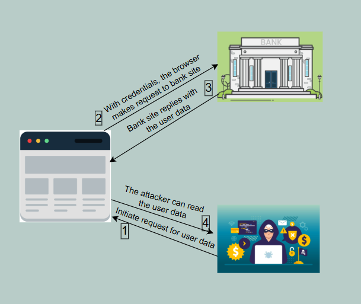
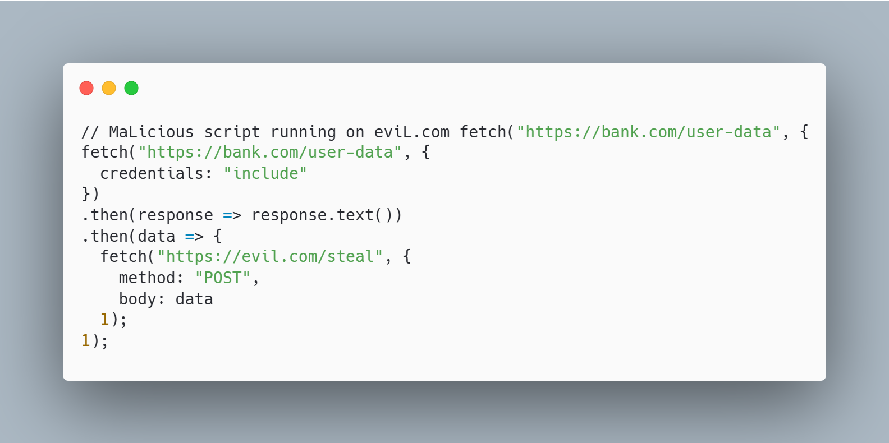

# SOP \- Same Origin Policy

During the early years of the Web, web pages were purely static, lacking the ability to exhibit dynamic behavior once loaded in the browser. This limitation created a strong desire to enhance web development and make websites more interactive. In response to this need, **Netscape** introduced **JavaScript** in **1995**, revolutionizing the way web pages function and paving the way for modern, dynamic web applications.  

### **The Security Problem: Unrestricted Cross-Origin Access**

In its early days, JavaScript had no restrictions on cross-origin access, allowing it to retrieve data from any website loaded in the browser. This posed a significant security risk—if multiple tabs or frames were open, a malicious site could exploit JavaScript to **read sensitive information** from another site, leading to potential data breaches.

**Example Scenario: How Unrestricted JavaScript Poses a Security Threat** 

 

						Fig: 01

### **Example Scenario: How Unrestricted JavaScript Poses a Security Threat**

Imagine you are logged into your bank account on **bank.com**, and at the same time, you visit a malicious site **evil.com**.

Without proper security restrictions, JavaScript on **evil.com** could execute the following attack:

1. **Stealing Sensitive Data** – The script on **evil.com** accesses and extracts sensitive information from **bank.com**.

2. **Sending Data to the Attacker** – The stolen data is transmitted to the attacker's server (e.g., **evil.com/steal**).

3. **Exploiting the Bank’s Trust** – The attack succeeds because when **bank.com** processes the request, it only verifies the user's credentials. It does not validate the origin of the request. Since the credentials are automatically sent with the request, the bank unknowingly processes the malicious action. 

**Associated Code Snippet:** 

         

					    Fig: 02

This vulnerability led to the need for **Same-Origin Policy (SOP)** to prevent unauthorized cross-origin access and protect user data. 

## The Introduction of the Same-Origin Policy (SOP)

In 1995, shortly after the introduction of JavaScript, Netscape introduced the **Same-Origin Policy (SOP)** to enhance web security. 

The policy states:  
 *"A JavaScript program is not allowed to read the properties of any window (or frame) or access objects within a window if the content was loaded from a different web server than the JavaScript program itself."*  

### **How SOP Enhances Security**

* **Prevents Cross-Origin Read Access** – JavaScript cannot read data from a different origin, blocking potential cross-origin attacks.

* **Allows Some Cross-Origin Embedding** – Certain elements, like ``, can still load resources from different origins.

* **Does Not Restrict Write Access** – SOP does not prevent JavaScript from sending data to a different origin, only from reading data across origins.

This policy remains a fundamental security measure in modern web development. 

**What is Origin?**   
**Origin** \= scheme(protocol)+hostname(domain)+port. To be of the same origin, all the three must be same.   
Example: 

| URL | Same or different? | Reason |
| :---- | :---- | :---- |
| http://example.com/app1/index.html http://example.com/app2/index.html  | Same  | Scheme, domain and port are same |
| http://example.com:80 http://example.com  | Same   | Scheme, domain and port are same |
| http://example.com/app1  https://example.com/app2  | Different  | Scheme is different |
| http://example.com http://www.example.com http://myapp.example.com  | Different  | Domain is different |
| http://example.com http://example.com:8080  | Different  | Port is different  |

						Table: 01

### References
1. https://github.com/ohari5336/book-1/blob/master/%5BSECURITY%5D%5BCORS%20in%20Action%5D.pdf
2. https://developer.mozilla.org/en-US/docs/Glossary/Origin 
3. https://www.youtube.com/watch?v=0YJ-yhoJh2I&t=1280s  