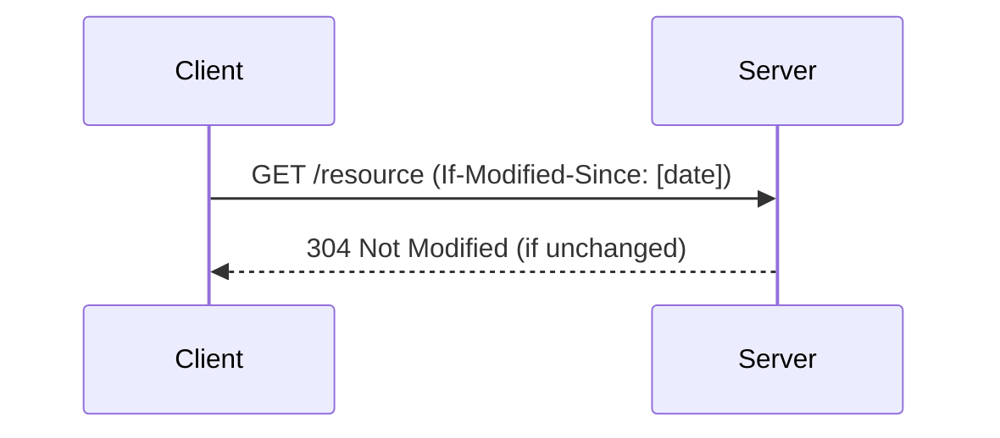

# HTTP Caching: The Critical Transition (1996–1999)
*From HTTP/1.0's Limitations to HTTP/1.1's Foundation*

## 1996: HTTP/1.0's Cache Directives

### `Pragma: no-cache`

```http
Pragma: no-cache  # All-or-nothing approach
```

**Problem**:
* No fine-grained control (e.g., couldn't cache CSS but block cookies)
* Depended on intermediaries' compliance

### `Expires`

```http
Expires: Wed, 21 Oct 2025 07:28:00 GMT  # Absolute timestamp
```

**Limitations**:
* Clock drift broke validation
* Buggy date parsers in early browsers/proxies

## 1997–1999: HTTP/1.1's Solutions (RFC 2068/2616)

### 1. `Cache-Control`: Granular Control

```http
Cache-Control: max-age=3600, must-revalidate  # Relative seconds
```

**Advancements**:
* Replaced `Pragma` with directives:
   * `public`/`private` (shared vs. user-specific caching)
   * `no-cache` (force revalidation)
   * `no-store` (block storage entirely)

### 2. Validation Headers

#### `ETag` (Entity Tag)

```http
ETag: "33a64df551425fcc55e4"  # Content fingerprint
```

**Impact**:
* Enabled precise cache validation via `If-None-Match`

#### `Last-Modified`

```http
Last-Modified: Tue, 22 Feb 2022 22:00:00 GMT  
```

**Validation Flow**:



### 3. `Vary`: Smart Caching

```http
Vary: Accept-Language, Accept-Encoding  # Cache per header combo
```

**Use Case**:
* Served English/Japanese versions from same URL

## Pre-2000 Cache Busting (Ad-Hoc Solutions)

### Workarounds for Static Resources

#### 1. Manual Filename Versioning

```diff
- logo.gif
+ logo_v2.gif  # Force new download
```

#### 2. Query Strings

```html
  # Changed manually
```

**Limitations**:
* No standardization (led to inconsistent implementations)

## Technical Comparison: 1996 vs. 1999

| Feature | HTTP/1.0 (1996) | HTTP/1.1 (1999) |
|---------|-----------------|-----------------|
| Time Control | `Expires` (absolute) | `max-age` (relative seconds) |
| Validation | None | `ETag` + `Last-Modified` |
| Cache Keys | URL-only | URL + `Vary` headers |
| Security | `Pragma: no-cache` | `private` + `no-store` |

## Why This Period Matters

1. **Fixed HTTP/1.0's Flaws**:
   * Clock drift (`Expires` → `max-age`)
   * Binary caching (`Pragma` → granular directives)
2. **Laid Modern Foundations**:
   * Validation (`ETag`), smart caching (`Vary`)
3. **Paved Way for Cache Busting**:
   * URL-based invalidation became necessary due to long `max-age`


<figure>
  <div align="center">
    
  </div>
  <figcaption style="text-align: center"></figcaption>  
</figure>

## References
2. [HTTP/1.1 Caching (RFC 9111)](https://datatracker.ietf.org/doc/html/rfc9111)
3. [MDN HTTP Caching](https://developer.mozilla.org/en-US/docs/Web/HTTP/Guides/Caching)
