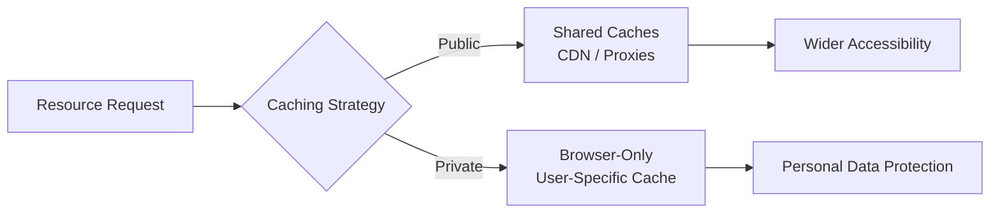
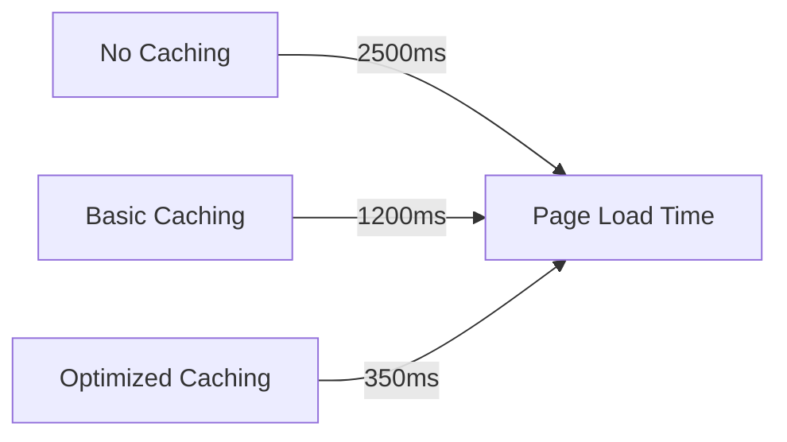
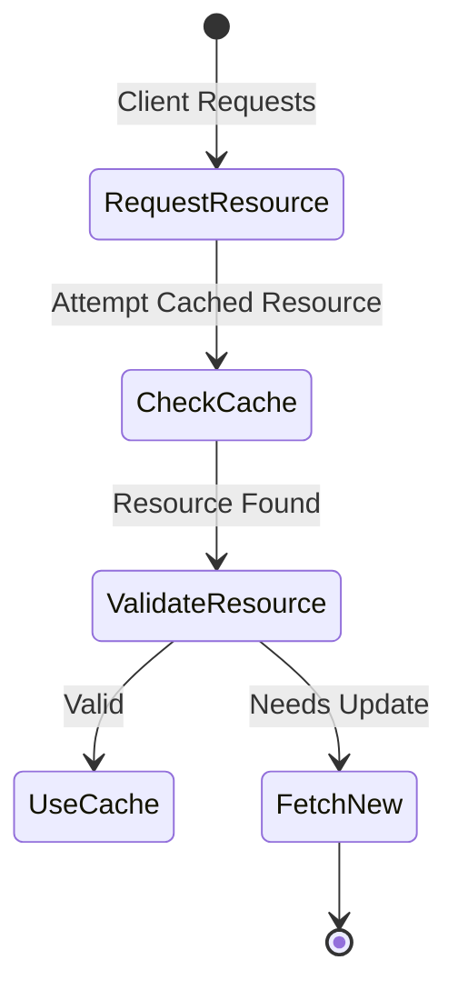
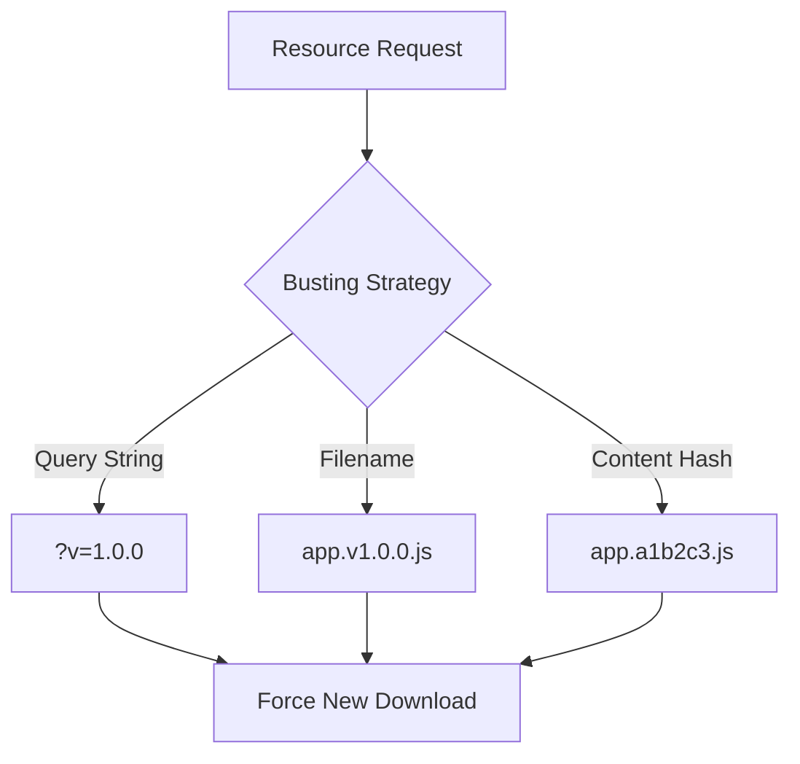
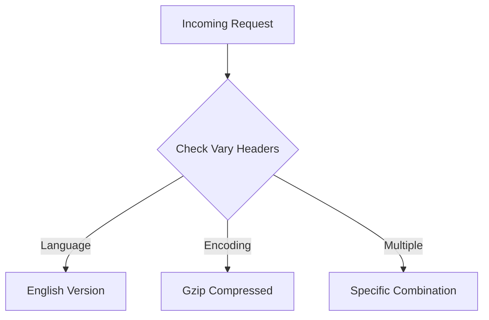

# 🚀 Mastering HTTP Caching: A Complete Evolution Guide

## �timeline Evolution of Web Caching

### HTTP/1.0 Era: The Early Days
- **`Pragma: no-cache`**: First attempt at cache control
- **`Expires` Header**: Introduced time-based caching
- **Limitations**: 
  - No granular control
  - Clock synchronization issues
  - Binary caching approaches

### HTTP/1.1: Advanced Caching Mechanisms

## 🛡️ Cache Visibility Directives

### 1. Cache-Control: Public vs Private

```http
# Public Caching (Shared Across Users)
Cache-Control: public, max-age=3600

# Private Caching (Browser-Specific)
Cache-Control: private, max-age=600
```

### Comparative Overview



## ⏰ Expiration Concepts

### Cache-Control: max-age Explained

```javascript
// Cache Validity Calculation
function isCacheValid(responseTime, maxAge) {
  const currentTime = new Date();
  const expirationTime = new Date(responseTime.getTime() + maxAge * 1000);
  return currentTime < expirationTime;
}
```

### Performance Impact Visualization



## 🔍 Validation Strategies

### Last-Modified vs ETag

```http
# Last-Modified Header
Last-Modified: Wed, 15 Nov 2023 12:00:00 GMT

# ETag Header
ETag: "686897696a7c876b7e"
```

### Validation Flow



## 🚫 Preventing Caching

### Cache-Control: no-store

```python
# Preventing Cache Storage
def handle_sensitive_response(response):
    response.headers['Cache-Control'] = 'no-store'
    return response
```

## 💥 Cache Busting Techniques

### Strategies Comparison



### Implementation Examples

1. **Query String Method**
   ```javascript
   const styleUrl = `/styles.css?v=${VERSION}`;
   ```

2. **Filename Versioning**
   ```javascript
   const scriptUrl = `/app.${TIMESTAMP}.js`;
   ```

## 🌐 Vary Header: Contextual Caching

### Dynamic Caching Scenarios

```http
# Vary Header Examples
Vary: Accept-Language
Vary: Accept-Encoding
Vary: Accept-Language, Accept-Encoding
```

### Vary Header Flow



## 🏆 Best Practices Checklist

- ✅ Use specific cache directives
- ✅ Implement intelligent cache busting
- ✅ Balance performance and data freshness
- ✅ Consider content sensitivity
- ✅ Validate cached resources

## 📊 Performance Metrics Comparison

| Caching Strategy | Page Load Time | Server Requests | Bandwidth Usage |
|-----------------|----------------|-----------------|-----------------|
| No Caching      | 2500ms         | 15              | High            |
| Basic Caching   | 1200ms         | 8               | Medium          |
| Optimized Caching| 350ms         | 3               | Low             |

## 💡 Pro Tips

1. **Always validate cached resources**
2. **Use ETags for precise caching**
3. **Implement different strategies for different content types**
4. **Monitor and adjust caching policies**

## 📚 Recommended Resources

- [MDN Web Docs: HTTP Caching](https://developer.mozilla.org/en-US/docs/Web/HTTP/Caching)
- [RFC 7234: HTTP/1.1 Caching](https://tools.ietf.org/html/rfc7234)

---

### 🚀 Final Thought

> Caching is not just a performance optimization – it's an art of balancing speed, freshness, and user experience.
